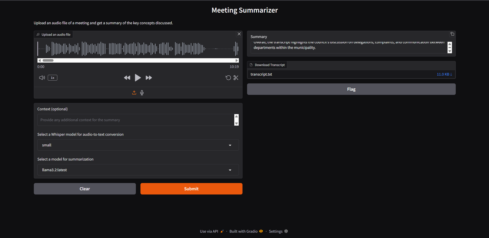

AI-Powered Meeting Assistant (Speaker-Aware)

A privacy-first, AI meeting assistant that transcribes audio, identifies individual speakers, and generates structured meeting summaries — all running 100% offline on your own hardware using WSL + Python + Local LLMs.

This project showcases end-to-end AI engineering: ASR, diarization, local LLM inference, cross-platform orchestration, and a simple web UI.

🧠 Key Features

Speaker-Aware Transcription using Whisper + NVIDIA NeMo/Pyannote

Fully Local LLM Summaries with Ollama + Llama 3.2

Privacy-First Architecture — no cloud services, all processing done on your machine

Cross-Platform Design — Windows frontend with Linux (WSL) backend

Simple Drag-and-Drop UI built using Gradio

End-to-End Automated Pipeline from audio → transcript → summary

🏗️ System Architecture

The application is composed of three AI engines orchestrated through a Python backend running inside WSL (Ubuntu):

🎙️ 1. Transcription Engine

OpenAI Whisper (via whisper-diarization pipeline)

Converts raw audio → text segments

🗣️ 2. Speaker Diarization Engine

NVIDIA NeMo / Pyannote

Detects who spoke when and labels each dialogue segment

🧾 3. Summarization Engine

Ollama running Llama 3.2

Generates structured summaries:

🔹 Key Points

🔹 Decisions

🔹 Action Items

🔹 Speaker-tagged transcript

🔁 Processing Pipeline (How It Works)

Upload audio through Gradio (MP3/M4A/WAV)

Audio is normalized with FFmpeg (16kHz mono)

Diarization + ASR pipeline runs

NeMo identifies speakers

Whisper transcribes spoken text

A formatted transcript.txt is generated:

Speaker 0: Good morning everyone…
Speaker 1: Let's begin with the updates…

Transcript is sent to Ollama

Llama 3.2 produces a structured, human-readable summary

Results are shown in the UI + transcript download is available

🛠️ Tech Stack
Layer	Technology
Frontend (UI)	Gradio
Backend	Python 3.10+, WSL (Ubuntu)
Transcription	Whisper
Diarization	NVIDIA NeMo / Pyannote
Summarization	Ollama, Llama 3.2
Audio Processing	FFmpeg, Torchaudio
Core Libraries	PyTorch, whisper-diarization, subprocess
